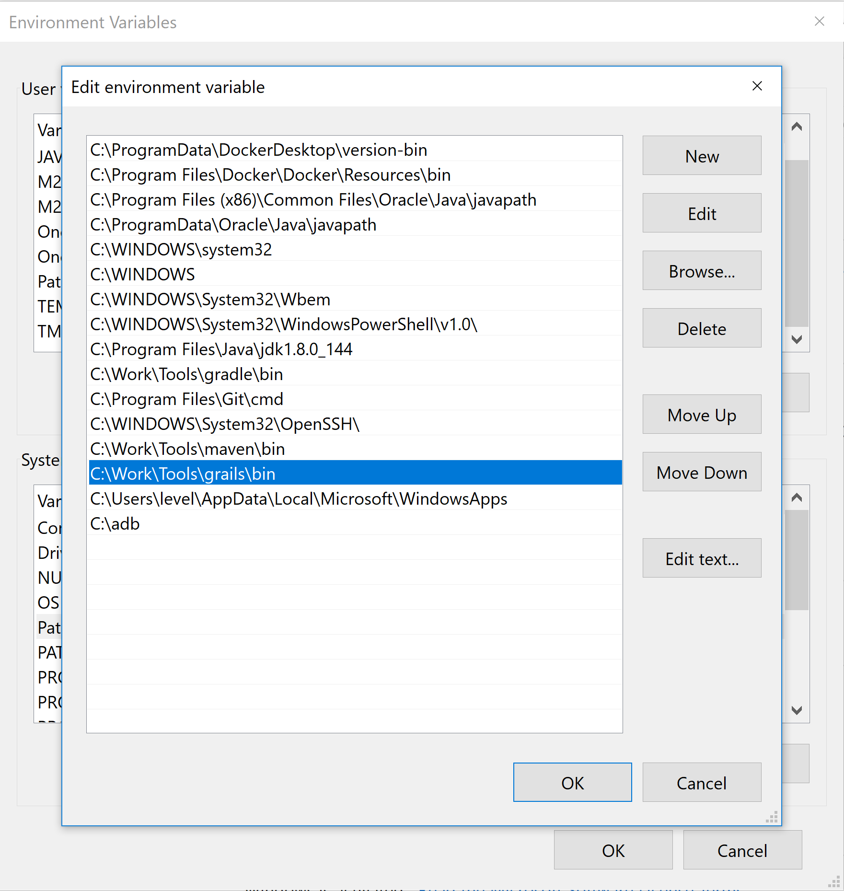

[[setting-up-tools]]
=== Setting up tools

In this Lab we will look at how to install the necessary tools for this course.

*Installing Tools*

After completing this section, you should be able to:

* Have your first grails app running on your machine.
* This setup only works for `windows 10` machines

*Locating the binaries or executables*

* Java: https://www.java.com/en/download/ (any version should work just fine)
    ** Install Java with default
* Grails: https://github.com/grails/grails-core/releases (latest release)
* IntelliJ: https://www.jetbrains.com/idea/download/#section=windows (Ultimate for Grails support)
    ** Install IntelliJ with default
* Docker: https://hub.docker.com/editions/community/docker-ce-desktop-windows (please register)
    ** Install Docker with default
*Environment Variables*

Some tools will require more attention for them to work:

1.  *OSX and Linux:*
+
TODO
2.  *Windows:*
+
2.1. Java and Grails

Java - https://www.google.com/search?q=java+environment+variables
Grails - unzip and put it in a location for `tools`, now in the same environment variables screen as for above `java`

*CLI tools check versions*

- Open a command prompt `WinKey+R` + type `cmd`.
- If any of below commands outputs other then the versions installed please review the steps.

[source,shell]
----
$ java --version
$ grails --version
$ docker --version
----

link:0_toc.adoc[Table Of Contents]