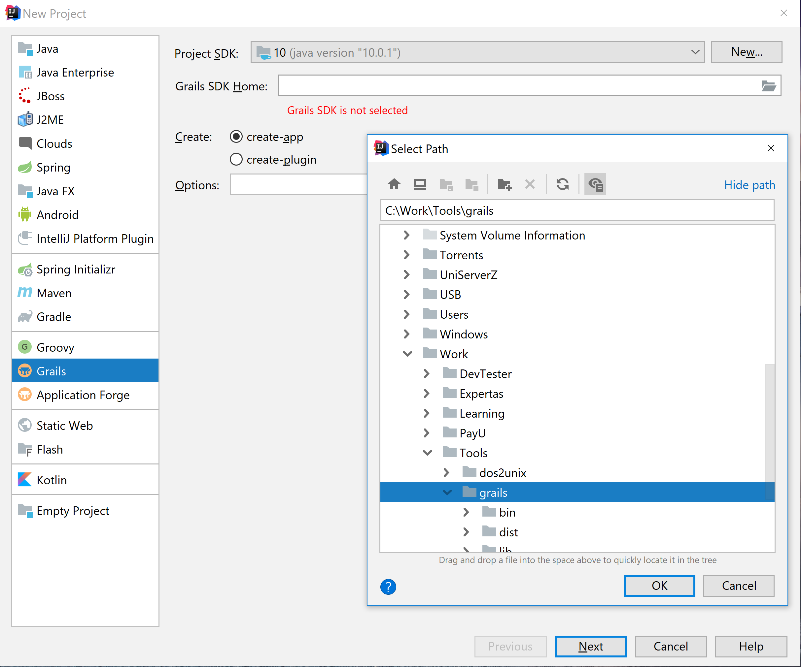
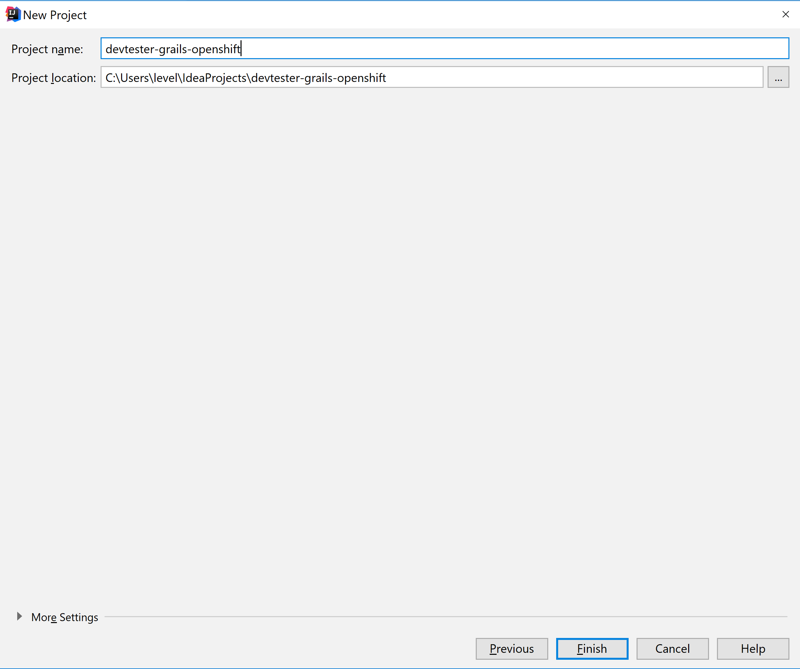
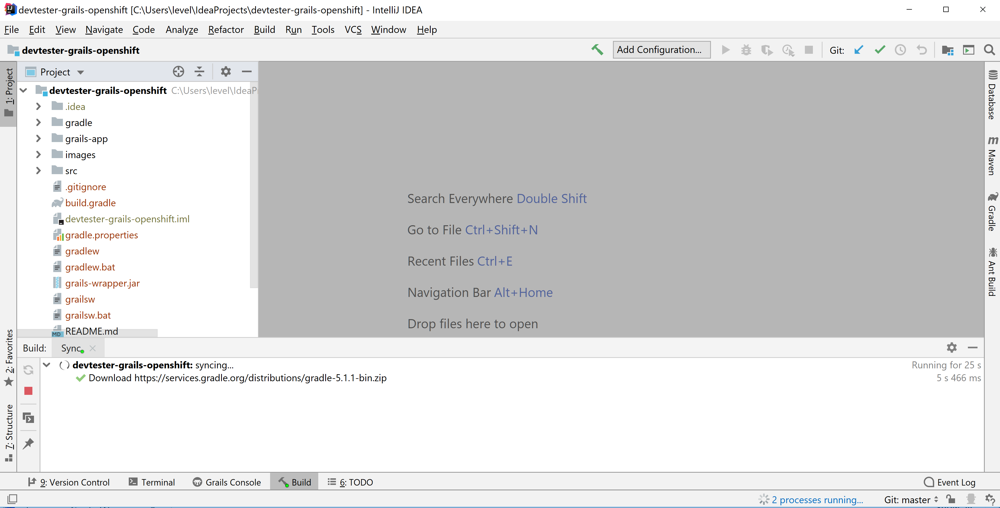

[[create-new-project]]
=== Create new project

In this Lab we will look at how create a new project.

*New base project*

After completing this section, you should be able to:

* Have your first grails app running on your machine.

*Start IntelliJ*

1. Click on `Create new Project`
2. Select `Grails` and now browse to the location where you have unzipped the grails files

3. Give your project a name e.g. : `devtester-grails-openshift`

4. In ~ 5 minutes your project should be setup

*Hit Play and wait for the browser*

link:0_toc.adoc[Table Of Contents]